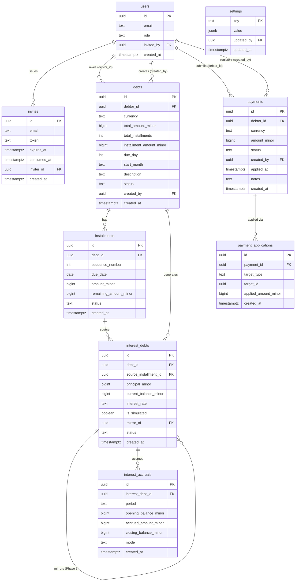

# Data Model

All monetary amounts are stored as `bigint` in minor units (céntimos for CRC, cents for USD). Currency and status values are plain `text` columns enforced by `CHECK` constraints — no PostgreSQL enum types.

## ERD

## Table Specifications

### `users`

Mirrors `auth.users.id` — the application row is created after Google OAuth first login.

| Column | Type | Constraints |
|--------|------|-------------|
| `id` | `uuid` | `PRIMARY KEY` — mirrors `auth.users.id` |
| `email` | `text` | `UNIQUE NOT NULL` |
| `role` | `text` | `NOT NULL CHECK (role IN ('admin', 'debtor'))` |
| `invited_by` | `uuid` | `REFERENCES users(id) ON DELETE SET NULL` |
| `created_at` | `timestamptz` | `NOT NULL DEFAULT now()` |

Indexes: `role`, `email`.

### `invites`

Admin-issued one-time invitation tokens. Token is a 32-byte hex string (crypto-random). Expires 7 days after creation.

| Column | Type | Constraints |
|--------|------|-------------|
| `id` | `uuid` | `PRIMARY KEY DEFAULT gen_random_uuid()` |
| `email` | `text` | `NOT NULL` |
| `token` | `text` | `UNIQUE NOT NULL` |
| `expires_at` | `timestamptz` | `NOT NULL` |
| `consumed_at` | `timestamptz` | nullable — `NULL` means unused |
| `inviter_id` | `uuid` | `NOT NULL REFERENCES users(id) ON DELETE RESTRICT` |
| `created_at` | `timestamptz` | `NOT NULL DEFAULT now()` |

Indexes: `token`, `email`.

### `debts`

A zero-rate installment obligation in a single currency.

| Column | Type | Constraints |
|--------|------|-------------|
| `id` | `uuid` | `PRIMARY KEY DEFAULT gen_random_uuid()` |
| `debtor_id` | `uuid` | `NOT NULL REFERENCES users(id) ON DELETE RESTRICT` |
| `currency` | `text` | `NOT NULL CHECK (currency IN ('CRC', 'USD'))` |
| `total_amount_minor` | `bigint` | `NOT NULL CHECK (total_amount_minor > 0)` |
| `total_installments` | `int` | `NOT NULL CHECK (total_installments BETWEEN 1 AND 120)` |
| `installment_amount_minor` | `bigint` | `NOT NULL CHECK (installment_amount_minor > 0)` |
| `due_day` | `int` | `NOT NULL CHECK (due_day BETWEEN 1 AND 28)` |
| `start_month` | `text` | `NOT NULL` — format `'YYYY-MM'` |
| `description` | `text` | nullable |
| `status` | `text` | `NOT NULL DEFAULT 'active' CHECK (status IN ('active', 'paid', 'cancelled'))` |
| `created_by` | `uuid` | `NOT NULL REFERENCES users(id) ON DELETE RESTRICT` |
| `created_at` | `timestamptz` | `NOT NULL DEFAULT now()` |

Indexes: `debtor_id`, `status`, `(debtor_id, status)`.

Note: `due_day` is capped at 28 to avoid February edge cases. Loans with day 29/30/31 are rounded down to 28; disclosed in UI help text.

Note: `start_month` uses `text` instead of `date` to avoid timezone-induced off-by-one errors when the app server and database are in different timezones.

### `installments`

One scheduled payment slice of a `Debt`.

| Column | Type | Constraints |
|--------|------|-------------|
| `id` | `uuid` | `PRIMARY KEY DEFAULT gen_random_uuid()` |
| `debt_id` | `uuid` | `NOT NULL REFERENCES debts(id) ON DELETE CASCADE` |
| `sequence_number` | `int` | `NOT NULL CHECK (sequence_number > 0)` |
| `due_date` | `date` | `NOT NULL` |
| `amount_minor` | `bigint` | `NOT NULL CHECK (amount_minor > 0)` |
| `remaining_amount_minor` | `bigint` | `NOT NULL CHECK (remaining_amount_minor >= 0)` |
| `status` | `text` | `NOT NULL DEFAULT 'pending' CHECK (status IN ('pending', 'paid', 'converted', 'overdue'))` |
| `created_at` | `timestamptz` | `NOT NULL DEFAULT now()` |
| — | — | `UNIQUE (debt_id, sequence_number)` |

Indexes: `debt_id`, `due_date`, `status`, `(debt_id, sequence_number)`.

### `interest_debts`

Compound-interest sub-debt created when a payment partially covers an installment.

| Column | Type | Constraints |
|--------|------|-------------|
| `id` | `uuid` | `PRIMARY KEY DEFAULT gen_random_uuid()` |
| `debt_id` | `uuid` | `NOT NULL REFERENCES debts(id) ON DELETE RESTRICT` |
| `source_installment_id` | `uuid` | `REFERENCES installments(id) ON DELETE RESTRICT` |
| `principal_minor` | `bigint` | `NOT NULL CHECK (principal_minor > 0)` |
| `current_balance_minor` | `bigint` | `NOT NULL CHECK (current_balance_minor >= 0)` |
| `interest_rate` | `text` | `NOT NULL` — decimal string snapshot, e.g. `"0.24"` |
| `is_simulated` | `boolean` | `NOT NULL DEFAULT false` |
| `mirror_of` | `uuid` | `REFERENCES interest_debts(id) ON DELETE SET NULL` — Phase 3 |
| `status` | `text` | `NOT NULL DEFAULT 'active' CHECK (status IN ('active', 'settled'))` |
| `created_at` | `timestamptz` | `NOT NULL DEFAULT now()` |

Indexes: `debt_id`, `source_installment_id`, `is_simulated`, `mirror_of`, `status`.

Note: `interest_rate` is a snapshot of `settings.default_annual_rate` at creation time. Admin changes to the rate do not retroactively alter existing `interest_debts`.

### `payments`

Money submitted by a debtor or registered directly by admin.

| Column | Type | Constraints |
|--------|------|-------------|
| `id` | `uuid` | `PRIMARY KEY DEFAULT gen_random_uuid()` |
| `debtor_id` | `uuid` | `NOT NULL REFERENCES users(id) ON DELETE RESTRICT` |
| `currency` | `text` | `NOT NULL CHECK (currency IN ('CRC', 'USD'))` |
| `amount_minor` | `bigint` | `NOT NULL CHECK (amount_minor > 0)` |
| `status` | `text` | `NOT NULL DEFAULT 'pending' CHECK (status IN ('pending', 'approved', 'rejected'))` |
| `created_by` | `uuid` | `NOT NULL REFERENCES users(id) ON DELETE RESTRICT` |
| `applied_at` | `timestamptz` | nullable — set when status becomes `'approved'` |
| `notes` | `text` | nullable |
| `created_at` | `timestamptz` | `NOT NULL DEFAULT now()` |

Indexes: `debtor_id`, `status`, `created_at`.

### `payment_applications`

Immutable audit log linking payments to their targets. Never updated or deleted.

| Column | Type | Constraints |
|--------|------|-------------|
| `id` | `uuid` | `PRIMARY KEY DEFAULT gen_random_uuid()` |
| `payment_id` | `uuid` | `NOT NULL REFERENCES payments(id) ON DELETE RESTRICT` |
| `target_type` | `text` | `NOT NULL CHECK (target_type IN ('installment', 'interest_debt'))` |
| `target_id` | `uuid` | `NOT NULL` — logical polymorphic FK; validated at app layer |
| `applied_amount_minor` | `bigint` | `NOT NULL CHECK (applied_amount_minor > 0)` |
| `created_at` | `timestamptz` | `NOT NULL DEFAULT now()` |

Indexes: `payment_id`, `(target_type, target_id)`.

Note: `target_id` is a logical (not DB-level) FK. The application layer validates `target_type` matches the correct table before every insert. This pattern keeps the FIFO allocation loop uniform across both target types.

### `interest_accruals`

Monthly compound interest record per `interest_debts` row.

| Column | Type | Constraints |
|--------|------|-------------|
| `id` | `uuid` | `PRIMARY KEY DEFAULT gen_random_uuid()` |
| `interest_debt_id` | `uuid` | `NOT NULL REFERENCES interest_debts(id) ON DELETE RESTRICT` |
| `period` | `text` | `NOT NULL` — format `'YYYY-MM'` |
| `opening_balance_minor` | `bigint` | `NOT NULL CHECK (opening_balance_minor >= 0)` |
| `accrued_amount_minor` | `bigint` | `NOT NULL CHECK (accrued_amount_minor >= 0)` |
| `closing_balance_minor` | `bigint` | `NOT NULL CHECK (closing_balance_minor >= 0)` |
| `mode` | `text` | `NOT NULL DEFAULT 'real' CHECK (mode IN ('real', 'simulated'))` |
| `created_at` | `timestamptz` | `NOT NULL DEFAULT now()` |
| — | — | `UNIQUE (interest_debt_id, period, mode)` |

Indexes: `interest_debt_id`, `period`, `(interest_debt_id, period, mode)`.

### `settings`

Admin-configurable key-value store. Keys are known constants; values are JSONB.

| Column | Type | Constraints |
|--------|------|-------------|
| `key` | `text` | `PRIMARY KEY` |
| `value` | `jsonb` | `NOT NULL` |
| `updated_by` | `uuid` | `REFERENCES users(id) ON DELETE SET NULL` |
| `updated_at` | `timestamptz` | `NOT NULL DEFAULT now()` |

Seed rows (idempotent via `ON CONFLICT DO NOTHING`):
- `default_annual_rate = "0.24"` — used when creating new `interest_debts`
- `simulated_annual_rate = "0.24"` — used for Phase 3 simulation track

## FK ON DELETE Summary

| Relationship | ON DELETE |
|--------------|-----------|
| `installments → debts` | `CASCADE` — deleting a debt deletes its schedule |
| `interest_debts → debts` | `RESTRICT` — cannot delete a debt with active sub-debts |
| `payment_applications → payments` | `RESTRICT` — audit trail is permanent |
| `interest_accruals → interest_debts` | `RESTRICT` |
| `users.invited_by → users` | `SET NULL` |
| `interest_debts.mirror_of → interest_debts` | `SET NULL` — Phase 3 self-reference |
| All others | `RESTRICT` |
