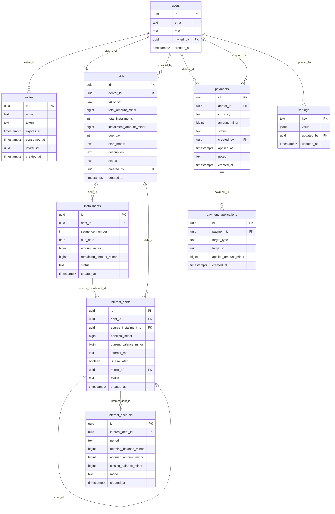

# AlexTePresta — Data Model

This document is the single source of truth for the database schema. All Supabase migrations must be derived from this document. See [charter.md](./charter.md) for domain definitions.

## Entity-Relationship Diagram

---

## Table Specifications

### `users`

Mirrors `auth.users.id` from Supabase Auth. Only invited users exist in this table.

| Column | Type | Constraints |
|--------|------|-------------|
| `id` | `uuid` | `PRIMARY KEY` — same value as `auth.users.id` |
| `email` | `text` | `UNIQUE NOT NULL` |
| `role` | `text` | `NOT NULL CHECK (role IN ('admin', 'debtor'))` |
| `invited_by` | `uuid` | `REFERENCES users(id) ON DELETE SET NULL` |
| `created_at` | `timestamptz` | `NOT NULL DEFAULT now()` |

**Indexes:** `(role)`, `(email)`

---

### `invites`

Single-use invitation tokens generated by the admin. A token is valid until `expires_at` and is consumed exactly once when the recipient registers.

| Column | Type | Constraints |
|--------|------|-------------|
| `id` | `uuid` | `PRIMARY KEY DEFAULT gen_random_uuid()` |
| `email` | `text` | `NOT NULL` — the invited email address |
| `token` | `text` | `UNIQUE NOT NULL` — 32-byte hex, crypto-random |
| `expires_at` | `timestamptz` | `NOT NULL` — `created_at + INTERVAL '7 days'` |
| `consumed_at` | `timestamptz` | `NULL` = unused; set when the invite is accepted |
| `inviter_id` | `uuid` | `NOT NULL REFERENCES users(id) ON DELETE RESTRICT` |
| `created_at` | `timestamptz` | `NOT NULL DEFAULT now()` |

**Indexes:** `(token)`, `(email)`

---

### `debts`

A zero-rate installment obligation. A single debt is single-currency; mixing currencies within one debt is prohibited by the data model.

| Column | Type | Constraints |
|--------|------|-------------|
| `id` | `uuid` | `PRIMARY KEY DEFAULT gen_random_uuid()` |
| `debtor_id` | `uuid` | `NOT NULL REFERENCES users(id) ON DELETE RESTRICT` |
| `currency` | `text` | `NOT NULL CHECK (currency IN ('CRC', 'USD'))` |
| `total_amount_minor` | `bigint` | `NOT NULL CHECK (total_amount_minor > 0)` |
| `total_installments` | `int` | `NOT NULL CHECK (total_installments BETWEEN 1 AND 120)` |
| `installment_amount_minor` | `bigint` | `NOT NULL CHECK (installment_amount_minor > 0)` |
| `due_day` | `int` | `NOT NULL CHECK (due_day BETWEEN 1 AND 28)` |
| `start_month` | `text` | `NOT NULL` — format `'YYYY-MM'`; timezone-neutral month reference |
| `description` | `text` | nullable |
| `status` | `text` | `NOT NULL DEFAULT 'active' CHECK (status IN ('active', 'paid', 'cancelled'))` |
| `created_by` | `uuid` | `NOT NULL REFERENCES users(id) ON DELETE RESTRICT` |
| `created_at` | `timestamptz` | `NOT NULL DEFAULT now()` |

**Indexes:** `(debtor_id)`, `(status)`

**Note on `start_month`:** A `text` column in `'YYYY-MM'` format is used instead of `date` to avoid timezone-related off-by-one errors when constructing `due_date` values. All date arithmetic uses `start_month` plus a month offset, computed in UTC.

**Note on `due_day`:** Capped at 28 to avoid February edge cases. Loans with a natural due day of 29, 30, or 31 should use 28 as the closest safe approximation; this is disclosed in the UI help text.

---

### `installments`

One scheduled payment slice of a `Debt`. Generated automatically when a debt is created.

| Column | Type | Constraints |
|--------|------|-------------|
| `id` | `uuid` | `PRIMARY KEY DEFAULT gen_random_uuid()` |
| `debt_id` | `uuid` | `NOT NULL REFERENCES debts(id) ON DELETE CASCADE` |
| `sequence_number` | `int` | `NOT NULL CHECK (sequence_number > 0)` |
| `due_date` | `date` | `NOT NULL` |
| `amount_minor` | `bigint` | `NOT NULL CHECK (amount_minor > 0)` — original scheduled amount; never changes |
| `remaining_amount_minor` | `bigint` | `NOT NULL CHECK (remaining_amount_minor >= 0)` — decremented as payments are applied |
| `status` | `text` | `NOT NULL DEFAULT 'pending' CHECK (status IN ('pending', 'paid', 'converted', 'overdue'))` |
| `created_at` | `timestamptz` | `NOT NULL DEFAULT now()` |

**Unique constraint:** `UNIQUE (debt_id, sequence_number)` — idempotency key for installment generation cron.

**Indexes:** `(debt_id)`, `(due_date)`, `(status)`

---

### `interest_debts`

A compound-interest sub-obligation created when a partial payment does not fully cover an installment. The `interest_rate` is a snapshot taken from `settings.default_annual_rate` at the moment of creation; it never changes after creation.

| Column | Type | Constraints |
|--------|------|-------------|
| `id` | `uuid` | `PRIMARY KEY DEFAULT gen_random_uuid()` |
| `debt_id` | `uuid` | `NOT NULL REFERENCES debts(id) ON DELETE RESTRICT` |
| `source_installment_id` | `uuid` | `REFERENCES installments(id) ON DELETE RESTRICT` — the installment that generated this sub-debt |
| `principal_minor` | `bigint` | `NOT NULL CHECK (principal_minor > 0)` — original shortfall amount; never changes |
| `current_balance_minor` | `bigint` | `NOT NULL CHECK (current_balance_minor >= 0)` — grows with accruals, shrinks with payments |
| `interest_rate` | `text` | `NOT NULL` — decimal string snapshot, e.g. `"0.24"` |
| `is_simulated` | `boolean` | `NOT NULL DEFAULT false` — `true` for Phase 3 simulation rows |
| `mirror_of` | `uuid` | `REFERENCES interest_debts(id) ON DELETE SET NULL` — Phase 3: links simulated row to its real counterpart |
| `status` | `text` | `NOT NULL DEFAULT 'active' CHECK (status IN ('active', 'settled'))` |
| `created_at` | `timestamptz` | `NOT NULL DEFAULT now()` |

**Indexes:** `(debt_id)`, `(source_installment_id)`, `(is_simulated)`, `(mirror_of)`, `(status)`

---

### `payments`

Money submitted by a debtor or registered directly by the admin. Starts as `pending`; transitions to `approved` or `rejected`.

| Column | Type | Constraints |
|--------|------|-------------|
| `id` | `uuid` | `PRIMARY KEY DEFAULT gen_random_uuid()` |
| `debtor_id` | `uuid` | `NOT NULL REFERENCES users(id) ON DELETE RESTRICT` |
| `currency` | `text` | `NOT NULL CHECK (currency IN ('CRC', 'USD'))` |
| `amount_minor` | `bigint` | `NOT NULL CHECK (amount_minor > 0)` |
| `status` | `text` | `NOT NULL DEFAULT 'pending' CHECK (status IN ('pending', 'approved', 'rejected'))` |
| `created_by` | `uuid` | `NOT NULL REFERENCES users(id) ON DELETE RESTRICT` — debtor or admin |
| `applied_at` | `timestamptz` | `NULL` until approved |
| `notes` | `text` | nullable |
| `created_at` | `timestamptz` | `NOT NULL DEFAULT now()` |

**Indexes:** `(debtor_id)`, `(status)`, `(created_at)`

---

### `payment_applications`

Immutable audit records. Every time a payment is applied to an installment or interest debt, one row is inserted here. Rows are never updated or deleted.

| Column | Type | Constraints |
|--------|------|-------------|
| `id` | `uuid` | `PRIMARY KEY DEFAULT gen_random_uuid()` |
| `payment_id` | `uuid` | `NOT NULL REFERENCES payments(id) ON DELETE RESTRICT` |
| `target_type` | `text` | `NOT NULL CHECK (target_type IN ('installment', 'interest_debt'))` |
| `target_id` | `uuid` | `NOT NULL` — logical FK; validated at application layer |
| `applied_amount_minor` | `bigint` | `NOT NULL CHECK (applied_amount_minor > 0)` |
| `created_at` | `timestamptz` | `NOT NULL DEFAULT now()` |

**Indexes:** `(payment_id)`, `(target_type, target_id)`

**Note on `target_id`:** This is a logical polymorphic foreign key. True referential integrity is not enforced at the database level because PostgreSQL does not support polymorphic FKs natively. The application layer must validate that `target_id` references a real row in `installments` (when `target_type = 'installment'`) or `interest_debts` (when `target_type = 'interest_debt'`) before inserting. This design was chosen over two nullable FK columns (`installment_id`, `interest_debt_id`) for uniformity in the FIFO allocation loop and extensibility if a third target type is ever added.

---

### `interest_accruals`

Monthly compound-interest growth records for `interest_debts`. The `UNIQUE (interest_debt_id, period, mode)` constraint guarantees idempotency — re-running the accrual cron for the same period has no effect.

| Column | Type | Constraints |
|--------|------|-------------|
| `id` | `uuid` | `PRIMARY KEY DEFAULT gen_random_uuid()` |
| `interest_debt_id` | `uuid` | `NOT NULL REFERENCES interest_debts(id) ON DELETE RESTRICT` |
| `period` | `text` | `NOT NULL` — format `'YYYY-MM'`, e.g. `'2026-04'` |
| `opening_balance_minor` | `bigint` | `NOT NULL CHECK (opening_balance_minor >= 0)` |
| `accrued_amount_minor` | `bigint` | `NOT NULL CHECK (accrued_amount_minor >= 0)` |
| `closing_balance_minor` | `bigint` | `NOT NULL CHECK (closing_balance_minor >= 0)` |
| `mode` | `text` | `NOT NULL DEFAULT 'real' CHECK (mode IN ('real', 'simulated'))` |
| `created_at` | `timestamptz` | `NOT NULL DEFAULT now()` |

**Unique constraint:** `UNIQUE (interest_debt_id, period, mode)` — idempotency key for accrual cron.

**Indexes:** `(interest_debt_id)`, `(period)`

---

### `settings`

Key-value store for admin-configurable application parameters.

| Column | Type | Constraints |
|--------|------|-------------|
| `key` | `text` | `PRIMARY KEY` |
| `value` | `jsonb` | `NOT NULL` |
| `updated_by` | `uuid` | `REFERENCES users(id) ON DELETE SET NULL` |
| `updated_at` | `timestamptz` | `NOT NULL DEFAULT now()` |

**Seed rows:**

| key | value | description |
|-----|-------|-------------|
| `default_annual_rate` | `"0.24"` | Annual interest rate applied to partial-payment conversions |
| `simulated_annual_rate` | `"0.24"` | Rate used for Phase 3 simulation track |
| `simulation_mode` | `false` | Whether simulation mode is currently active |

---

## FK ON DELETE Behavior Summary

| Child table | Parent table | Column | ON DELETE |
|-------------|-------------|--------|-----------|
| `invites` | `users` | `inviter_id` | `RESTRICT` |
| `debts` | `users` | `debtor_id` | `RESTRICT` |
| `debts` | `users` | `created_by` | `RESTRICT` |
| `installments` | `debts` | `debt_id` | `CASCADE` — deleting a debt removes its entire schedule |
| `interest_debts` | `debts` | `debt_id` | `RESTRICT` — cannot delete a debt with active sub-debts |
| `interest_debts` | `installments` | `source_installment_id` | `RESTRICT` |
| `interest_debts` | `interest_debts` | `mirror_of` | `SET NULL` |
| `payments` | `users` | `debtor_id` | `RESTRICT` |
| `payments` | `users` | `created_by` | `RESTRICT` |
| `payment_applications` | `payments` | `payment_id` | `RESTRICT` — audit trail is permanent |
| `interest_accruals` | `interest_debts` | `interest_debt_id` | `RESTRICT` |
| `users` | `users` | `invited_by` | `SET NULL` |
| `settings` | `users` | `updated_by` | `SET NULL` |

---

## Migration Notes

- Migrations live in `supabase/migrations/` and are forward-only; never edit a published migration.
- Suggested split: `0001_init.sql` (all tables + constraints), `0002_rls.sql` (all RLS policies), `0003_seed_settings.sql` (seed rows).
- The `UNIQUE (debt_id, sequence_number)` constraint on `installments` must be in place before the installment-generation cron runs.
- The `UNIQUE (interest_debt_id, period, mode)` constraint on `interest_accruals` must be in place before the accrual cron runs.
